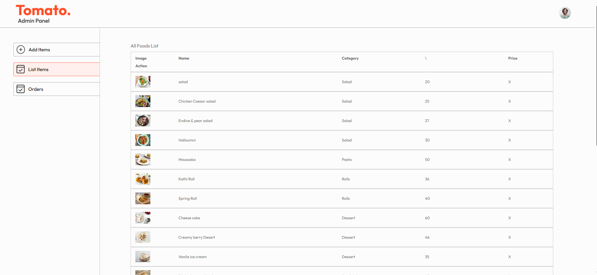

# 🍔 Food Delivery App (MERN Stack)

A full-stack food delivery web application built using the MERN stack. This project allows users to browse food items, add them to cart, place orders, and manage them through an admin panel.

---

## 🚀 Live Demo

- 🌐 Frontend:https://food-delivery-app-frontend-v732.onrender.com
- 🌐 Admin:https://food-delivery-app-admin-84w9.onrender.com 
- ⚙️ Backend API:https://food-delivery-app-backend-cef0.onrender.com
---

## 🧾 Features

### 👤 User Features
- User authentication (Login / Register)
- Browse food items by categories
- Add/remove items from cart
- Place orders
- View order history

### 🛠 Admin Features
- Add / update / delete food items
- Manage orders
- View users and order details

---

## 🖥️ Tech Stack

**Frontend:**
- React.js
- CSS / Tailwind (if used)
- Axios

**Backend:**
- Node.js
- Express.js
- MongoDB
- Mongoose
- JWT Authentication

**Deployment:**
- Frontend: Vercel / Netlify  
- Backend: Render  
- Database: MongoDB Atlas  

---

## 📸 Screenshots

## 📸 Screenshots

<p align="center">
  
  
</p>

<p align="center">
  
  
  
</p>
---

## ⚙️ Installation & Setup

### 1. Clone the repository
```bash
git clone https://github.com/your-username/your-repo.git
cd your-repo
2. Install dependencies
Backend
npm install
Frontend
cd frontend
npm install
3. Environment Variables

Create a .env file in the root:

MONGO_URI=your_mongodb_connection_string
JWT_SECRET=your_secret_key

For frontend, create .env inside frontend:

REACT_APP_API_URL=https://your-backend-link.onrender.com
4. Run the project locally
Start backend:
npm start server
Start frontend:
cd frontend
npm run dev
cd admin
npm run dev
📦 Build for Production
cd frontend
npm run build

---

